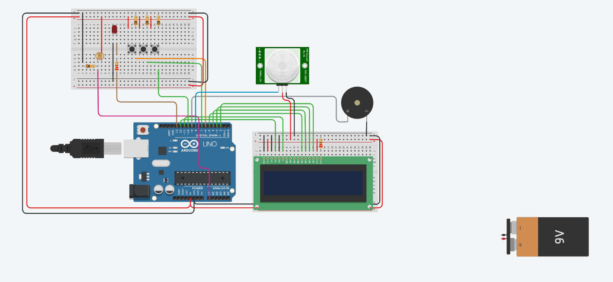

# 🚨 Alarme com Sensor de Presença e Movimento (Arduino)
📷 Circuito no Tinkercad


## 📌 Descrição do Projeto

Este projeto implementa um **sistema de alarme utilizando sensor de presença/movimento** com Arduino.
Quando o sensor detecta movimento, o sistema **ativa um alerta sonoro (buzzer)** e exibe informações em um **display LCD**, indicando que houve detecção.

O circuito também inclui **botões para controle do sistema** e **LEDs indicadores**, permitindo simular um sistema de segurança simples utilizado em ambientes residenciais ou educacionais.

---

## ⚙️ Componentes Utilizados

* 1 × Arduino Uno R3
* 1 × Sensor de movimento PIR
* 1 × Display LCD 16x2
* 1 × Buzzer
* 3 × Botões (push buttons)
* 1 × LDR (sensor de luminosidade)
* Resistores (220Ω / 10kΩ)
* 1 × Protoboard
* Jumpers (fios de conexão)

---

## 🔌 Principais Conexões

### Sensor PIR

* VCC → 5V do Arduino
* GND → GND
* OUT → pino digital do Arduino

### Buzzer

* Pino positivo → pino digital do Arduino
* Pino negativo → GND

### Display LCD 16x2

Conectado aos pinos digitais do Arduino utilizando comunicação paralela (modo 4 ou 8 bits dependendo da configuração).

### Botões

Utilizados para funções como:

* Ativar o alarme
* Desativar o alarme
* Resetar o sistema

### LDR

O sensor de luminosidade pode ser usado para **monitorar o ambiente**, permitindo futuras implementações como ativação automática do sistema em ambientes escuros.

---

## 🔄 Funcionamento do Sistema

1. O sistema inicializa e configura os pinos do Arduino.
2. O sensor PIR monitora continuamente o ambiente.
3. Quando **movimento é detectado**:

   * O buzzer é ativado
   * Uma mensagem é exibida no **LCD**
   * LEDs podem indicar estado de alerta
4. O sistema pode ser **controlado pelos botões**, permitindo ativar ou desativar o alarme.

Esse tipo de sistema é utilizado como base para:

* sistemas de **segurança residencial**
* **automação residencial**
* projetos educativos de **sistemas embarcados**

```

## 🚀 Possíveis Melhorias

Algumas evoluções possíveis para o projeto:

* Adicionar **teclado numérico para senha**
* Integrar **módulo GSM para enviar SMS**
* Utilizar **WiFi (ESP8266 ou ESP32)** para enviar alertas
* Criar **registro de eventos no display**
* Integrar com **aplicativo mobile**

---

## 🎯 Objetivo Educacional

Este projeto foi desenvolvido para praticar conceitos de **sistemas embarcados com Arduino**, incluindo:

* leitura de sensores digitais
* uso de sensores PIR
* controle de atuadores (buzzer)
* uso de display LCD
* lógica de monitoramento em tempo real

---
